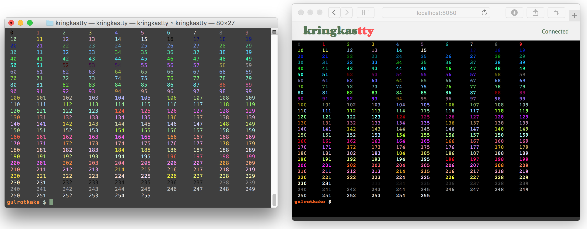

# kringkastty

Standalone executable to broadcast a tty via websockets.

Built upon code from other great projects:
 - [**ttyrec**](http://0xcc.net/ttyrec/index.html.en)
 - [**mongoose**](https://github.com/cesanta/mongoose)
 - [**term.js**](https://github.com/chjj/term.js)
 - [**vt100-emulator**](https://github.com/JulienPalard/vt100-emulator)

## Name

- **kringkast** Norwegian for broadcast
- **tty** Commonly used abbreviation for terminal emulators, historically used as an abbreviation for a teletype.

## Build instructions

 From the project directory, run ``make``.

## Usage

  After building run ``./build/kringkastty``. A broadcast immediately becomes available at ``http://localhost:8080``
  
## Screenshots

